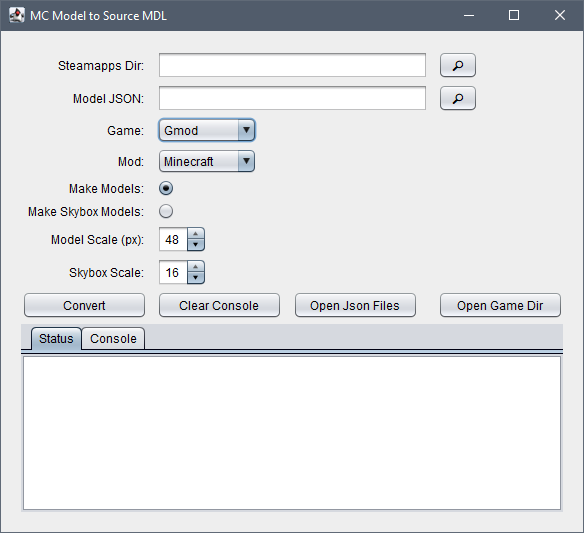

- Convert Java Minecraft models to Source Engine's SMD and MDL and textures to VTF and VMT. GUI interface for easy 
  conversions for TF2, GMod Currently.
  Will be set up for more in the future. This uses a Python script to do the work while the interface is Java. 
  mcexport.py was originally forked from https://gist.github.com/alexiscoutinho. I did some tweaks to get things
  working, mostly experimenting with getting custom models to export along with Bedrock models. 

- After unpacking, extract minecraft.jar assets into project's assets folder.
- Python 3.14 or higher may be required.
  "Pillow" python module may also have to be installed for python script to work.
  Try running it before installing. 
  Can be done in command prompt, running "pip3 install pillow".
  Check online for more installation info.

- Once installed, run "start.bat" from root directory.
- Set your "Steamapps" folder location.
- Select one or multiple minecraft json models in the Model JSON field. Point to your project's assets folder.
- From there, its assets -> minecraft -> models -> block, then select one or multiple files.
  Select your game from dropdown.
- Select "make models" for the default mode, "model scale" will be used, default 48.
- Select "make skybox models" for models scaled by the Skybox Scale, default 16.
- Click "Convert" to start conversion.
- QC, QCI and SMD files can be found in "assets/mcexports/" folder.
- All models compiled and textures will be added to the game folder in models and materials under minecraft.

- Only Java Minecraft models are currently supported in the version.
  Some models may not work like chest since the json file doesn't contain a parent file pointing to
  the elements required to build the model. Other json files may error for reasons related to how the json is written.
 
