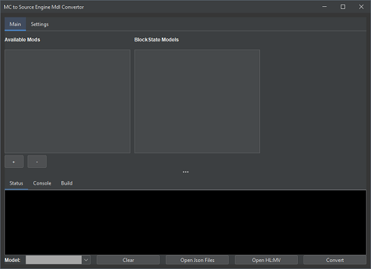

- Convert Java Minecraft models to Source Engine's SMD and MDL and textures to VTF and VMT. GUI interface for easy 
  conversions for all Source Engine games.
  Will be set up for more in the future. This uses a Python script to do the work while the interface is Java. 
  'mcexport.py' was originally forked from https://gist.github.com/alexiscoutinho. I did some tweaks to get things
  working, mostly experimenting with getting custom models to export along with Bedrock models. I am working on adding 
  more ways custom models can be added. 

- Python 3 is required. (compiled with Python 3.14)
  "Pillow" python module must be installed for python script to work. 
  Can be installed in command prompt, running "pip3 install pillow".
  Check online for more installation info.

  - Cloning IDE Setup (Intellij)
    - File > Project Structure > Project Settings 
      - Project
        - SDK: Oracle OpenJDK 25.0.2
        - Language Level: SDK Default
      - Modules
        - Language Level: Project Default
        - Mark 'src' as Sources

    - Maven:
      - 'Resync All Maven Projects'

    - Run Configurations:
      - Add new 'Application'
        - set 'Main Class' to 'main.GUIStart' or select from browse

- If Release, extract and run "start.bat" from root directory.

- Usage:
  - Set your "Steamapps" folder location in Settings tab.
  - Select your game from dropdown.
  - Select "make models" for the default mode, "model scale" will be used, default 48 (hammer units).
  - Select "make skybox models" for models scaled by the Skybox Scale, default 16.

  - In Main, Add Minecraft jar file with '+' button. 
    Can add any mod.jar or folder of jars as long as it's Java and not Bedrock.
    Any mod without a 'blockstates' directory will not be added.
  - Select one or multiple minecraft json models in the Model List.

  - Click "Convert" to start conversion.
  - QC, QCI and SMD files can be found in "assets/mcexports/" folder.
  - All models compiled and textures will be added to the game folder in models and materials under minecraft.
  - 'HL:MV' button to open selected compiled model in hl:mv.
  - 'Open json Files' button will open all json texts used in conversion.
  - 'Clear Console' button to clear everything.

- Only Java Minecraft models are currently supported in the version.
  Some models may not work like chest since the json file doesn't contain a parent file pointing to
  the elements required to build the model. Other json files may error for reasons related to how the json is written.
 
